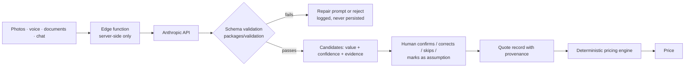

# AI architecture

## The boundary

The model is allowed to **extract, classify, question, identify risk and draft prose**.

It is not allowed to **produce a price, perform arithmetic, confirm a fact, or certify
compliance**.

That line is not a stylistic preference. A price a contractor cannot explain is a
commercial liability, and a model asked to do arithmetic will occasionally be confidently
wrong in a way no amount of prompting reliably prevents. Every number a client sees comes
from `@cleanquote/pricing-engine`.

Nothing reaches the engine without passing through the human confirmation step.

## Model output is untrusted input

Everything a model returns parses through Zod before it can be stored or used. Three
constraints in those schemas are load-bearing:

**Asset counts are `visibleQuantity`, never `quantity`.** Photo coverage of a site is
partial by nature. "Eight visible windows detected" is a claim the model can support; "the
site has eight windows" is not. A model that returns the latter field name fails to parse.

**Compliance findings must carry `requiresHumanReview: true`.** The literal is enforced by
the schema, so output claiming a site _is_ compliant cannot be persisted. The platform
identifies, documents and prices regulatory requirements; it does not certify them.

**Confidence must be within 0–1, and suggested questions are capped at ten.** A copilot
that asks twenty questions has defeated the purpose of a low-input product, so the contract
caps it rather than trusting the prompt to behave.

## Question minimisation

Before asking anything, the copilot resolves in order:

1. Does the answer materially affect price, scope, risk or compliance? If not, do not ask.
2. Can it be inferred safely from what is already captured?
3. Can an editable default stand in?
4. Can it be deferred to the review screen?
5. Can several related facts be confirmed in one question?

At most three questions are shown at once, ordered by commercial impact. Every one offers
confirm, correct, skip, mark-as-assumption, or ask-the-client-later.

## Provenance and confidence

Every AI-derived fact is stored with `evidence_source`, `verification_status` and
`ai_confidence`. The review screen shows what the model proposed next to what the human
confirmed, and the pricing engine's confidence score reflects how much of the capture has
actually been verified.

An unconfirmed AI suggestion is never counted as a confirmed fact, and never silently
becomes one by being left alone.

## Cost control

- Cheap models for classification and summarisation; capable models for tender analysis.
- Stable organisation context is cached rather than resent.
- Images are compressed and analysed at a thumbnail variant; unchanged images are not
  resent.
- Every run is logged to `ai_runs` with tokens, estimated cost, latency, schema-validation
  result and — importantly — **whether the user accepted the suggestion**. That last column
  is what makes "is the copilot actually helping?" a measurable question rather than an
  opinion.
- `AI_MONTHLY_BUDGET_PER_ORG` is a hard ceiling. Requests are refused past it, not queued.
- Files flagged `exclude_from_ai` are never sent, whatever the request says.

## Provider abstraction

`AI_PROVIDER` selects between `anthropic` and `mock`. The mock provider returns fixture
extractions so the whole copilot flow can be developed and tested without an account or
any spend, and so CI never depends on a third-party API.

Prompts are versioned in `ai_prompt_versions`, which is the one table with **no policy for
any tenant role** — prompt templates are read only by definer-rights server functions.

The API key is server-side only. `serverEnv()` throws if imported into a browser bundle,
so the mistake fails at build time rather than shipping a key to every visitor.

## Current status

The contracts, schemas, database tables and cost-control design are complete and tested.
The live integration is not built. See [ROADMAP.md](ROADMAP.md) — it sits after mobile
capture, because extraction needs something real to extract from, and because rate limiting
must land before any model endpoint is exposed.
