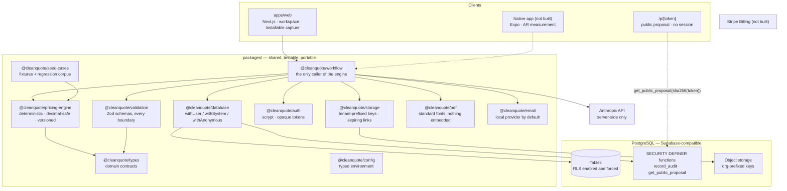
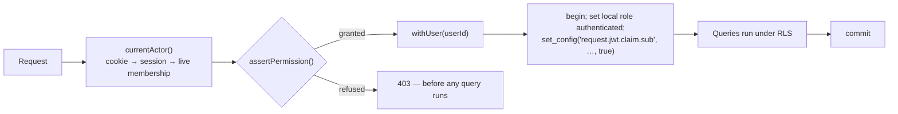
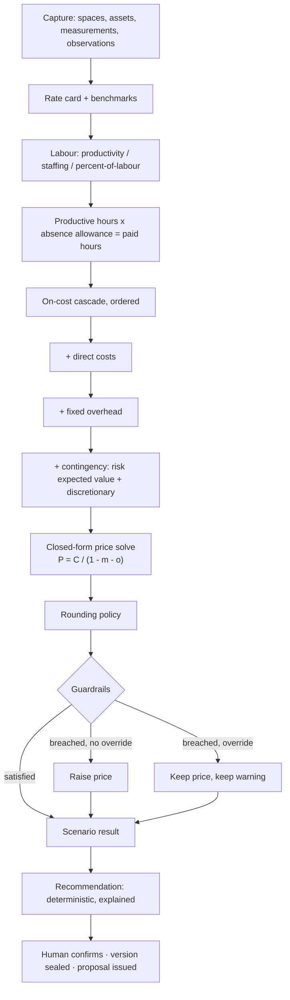

# Architecture

## Shape

Note the shape: `@cleanquote/workflow` is the only thing that calls the pricing engine, and
the web app never reaches past it to the database for anything a workflow function owns. A
React component that computed part of a price would be able to disagree with the stored
snapshot, so no component is given the chance.

## The decisions that matter

### The pricing engine is a package, not application code

A quotation is a commercial record that must be defensible months after it is issued.
Keeping the arithmetic in one pure, versioned, heavily tested package means a price can be
reproduced exactly, and that the mobile app, the web app and any future server function
cannot drift from each other. It also means the engine is portable: nothing in it knows
about Supabase, React or HTTP.

### The AI never produces a price

The model extracts, classifies, questions, identifies risk and drafts prose. The
deterministic engine produces every number a client sees. This is not caution for its own
sake — an unexplainable price is a commercial liability, and a model that is asked to do
arithmetic will occasionally be confidently wrong in a way no test can catch.

See [AI_ARCHITECTURE.md](AI_ARCHITECTURE.md).

### Provenance travels with every fact

Nothing captured is stored as a bare value. `evidence_source`, `verification_status` and
`ai_confidence` accompany spaces, assets, observations and measurements, so the review
screen can distinguish what the AI proposed from what a human confirmed. An observation
also records `observation_window_complete` — `NOT NULL` with no default, so the capture UI
has to ask whether the estimator saw the whole shift or part of it. A partial window can
support a price; it cannot define one.

### Configuration is data

Product name, scenario labels, plan limits, entitlements, calendar assumptions, on-cost
rules, overhead recovery methods and commercial floors are all rows or environment values.
Adding a plan, renaming a strategy or changing a jurisdiction's payroll tax is not a
deploy.

### Sent versions are sealed

Once a quote version is sent it is immutable; a revision is a new version. This is what
makes "what exactly did we quote in March?" answerable, and it is enforced by a trigger
rather than by convention.

### The monorepo lives under `cleanquote/`

This repository already hosts an unrelated static site at the root. Placing the monorepo
in a subdirectory keeps that deployment working untouched. If CleanQuote becomes the
repository's primary concern, promoting it to the root is a mechanical move.

## Runtime modes

The application runs with nothing configured. Every integration degrades to a documented
local mode, and the UI states which mode it is in rather than pretending.

| Integration | Absent                                              | Present                              |
| ----------- | --------------------------------------------------- | ------------------------------------ |
| PostgreSQL  | The demonstration cases at `/demo` still price live | The full workspace, under RLS        |
| Anthropic   | Mock provider returns deterministic extractions     | Live extraction, logged and budgeted |
| Email       | Local provider records messages at `/dev/inbox`     | Delivered by the configured HTTP API |
| Storage     | Local adapter writes under `STORAGE_LOCAL_ROOT`     | Any S3-compatible endpoint           |
| Stripe      | Entitlements come from plan defaults                | Not built                            |
| Sentry      | Errors to stdout                                    | Errors reported                      |

This is deliberate: the whole product should be developable, testable and demonstrable
before any external account exists.

## Quote lifecycle

Diagrams for the lifecycle, AI confirmation, approval invalidation, proposal publication
and client acceptance live in [WORKFLOW.md](WORKFLOW.md), alongside the code paths they
describe.

## Where the tenant identity is established

Exactly one place. `withUser()` opens a transaction, sets the `authenticated` role and
binds `request.jwt.claim.sub` with `set_local`, so both settings are scoped to the
transaction and a pooled connection cannot carry an identity from one request into the
next.

The permission check in the application is the first of two. The row-level policy is the
one that actually protects the data, which is why a hidden button is never treated as a
control.

## Calculation flow

The human confirmation step is not decorative. No price is issued without a person
accepting the scope, the assumptions and the number.

## What is not built

The mobile capture app, AR measurement, the AI copilot, tender document intelligence,
proposal generation, the client portal, billing and the admin platform are designed for
but not implemented. [ROADMAP.md](ROADMAP.md) states the order and the reasoning.
