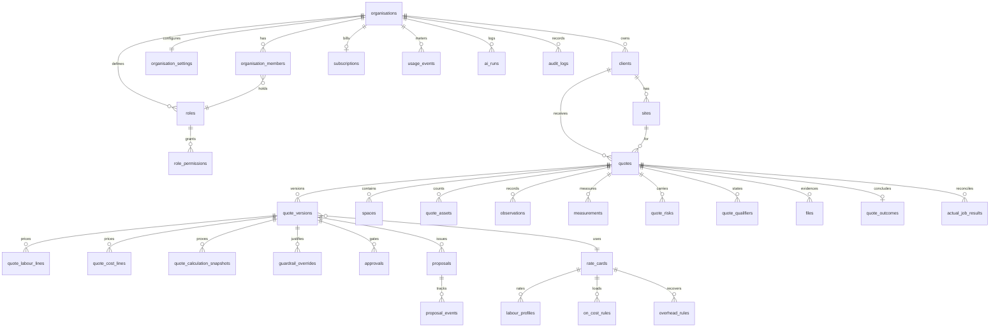

# Data model

## Conventions

- Every tenant-owned table carries `organisation_id uuid not null`.
- UUID primary keys, v7 where the server supports it so they sort by creation time.
- `created_at` / `updated_at` set by the database, never by the application.
- Money is `numeric` — rates at 4 dp, amounts at 2 dp. Never float.
- User-facing records soft delete (`deleted_at`); system records hard delete.
- Units are explicit in the column name (`floor_area_sqm`, `ceiling_height_m`).

## Constraints that carry meaning

Some constraints in this schema are product decisions, not hygiene:

| Constraint                                                               | Why it exists                                                                                                                       |
| ------------------------------------------------------------------------ | ----------------------------------------------------------------------------------------------------------------------------------- |
| `observations.observation_window_complete` is `NOT NULL` with no default | Forces the capture UI to ask whether the estimator saw the whole shift. An observed cleaner count is not an incumbent labour model. |
| `files.storage_path like organisation_id \|\| '/%'`                      | Makes storage isolation decidable from the path alone, without a join.                                                              |
| `guardrail_overrides.reason` length ≥ 20                                 | An override is an auditable act. A one-word reason defeats the purpose of recording one.                                            |
| `overhead_rules` revenue method `< 100`                                  | Revenue overhead at 100% leaves nothing to price against; the engine would have no finite solution.                                 |
| `quote_versions.sealed_at` + trigger                                     | A sent version is the record of what the client received. Revisions are new versions.                                               |
| `productivity_benchmarks.approved_at`                                    | A benchmark learned from completed jobs only takes effect once a human approves it. Nothing silently re-prices future quotes.       |
| `rate_cards.locked_at`                                                   | A rate card that has priced a sent quote must not change underneath it.                                                             |
| `quote_labour_lines` per-kind completeness checks                        | A `productivity` line without a rate, or a `staffing` line without hours, is not a line — it is a bug waiting to be priced.         |

## Table map



## Groups

**Tenancy** — `organisations`, `organisation_settings`, `organisation_members`, `roles`,
`role_permissions`, `permissions`, `user_profiles`. `parent_organisation_id` supports
franchise and multi-branch structures; whether branches share data is a settings decision,
not a schema assumption.

**Capture** — `clients`, `client_contacts`, `sites`, `quotes`, `buildings`, `floors`,
`spaces`, `asset_types`, `quote_assets`, `observations`, `measurements`, `files`,
`quote_risks`, `quote_qualifiers`. Every captured fact carries `evidence_source`,
`verification_status` and, where AI-derived, `ai_confidence`.

**Rate cards** — `rate_cards`, `labour_profiles`, `on_cost_rules`, `overhead_rules`,
`cost_catalogue_items`, `margin_rules`, `scenario_configs`, `productivity_benchmarks`.
Benchmarks with a null `organisation_id` are platform-published and readable by everyone
once approved.

**Pricing** — `quote_versions`, `quote_labour_lines`, `quote_cost_lines`,
`quote_calculation_snapshots`, `guardrail_overrides`, `approvals`, `approval_comments`.
The snapshot stores the complete engine input, the complete output and the input hash, so
a price is reproducible even after the rate card changes.

**Delivery** — `proposal_templates`, `proposals`, `proposal_events`, `quote_outcomes`,
`actual_job_results`. Templates control which financial detail a client sees; internal
scenario names, cost lines and margin never appear in a client-facing document.

**Platform** — `plans`, `plan_entitlements`, `plan_limits`, `subscriptions`,
`organisation_entitlements`, `usage_events`, `ai_threads`, `ai_messages`, `ai_runs`,
`ai_prompt_versions`, `notifications`, `audit_logs`.

## Deferred tables

The specification lists tables not yet created, because nothing consumes them yet and an
unused table is a maintenance cost with no benefit: `space_templates`, `task_templates`,
`service_schedules`, `equipment_catalogue`, `consumables_catalogue`, `integrations`,
`webhooks`, `photo_annotations`, `extracted_objects`, `walkthrough_participants`. Each is
additive and lands with the phase that needs it.

## Migrations

Forward-only, applied in filename order, named `<timestamp>_<description>.sql`.

```
20260726000100_foundation.sql                 extensions, timestamp trigger, enums
20260726000200_tenancy.sql                    organisations, membership, auth helpers
20260726000300_crm_and_capture.sql            clients, sites, quotes, capture domain
20260726000400_rate_cards_and_pricing.sql     rate cards, versions, snapshots, approvals
20260726000500_proposals_billing_ai_audit.sql proposals, plans, AI logging, audit
20260726000600_row_level_security.sql         policies, grants, storage, public proposal
```

The grant statement in the final migration is a snapshot of the tables existing at that
point. **Any later migration adding a table must grant on it explicitly** — a table with no
grant is invisible to the application regardless of its policies.
