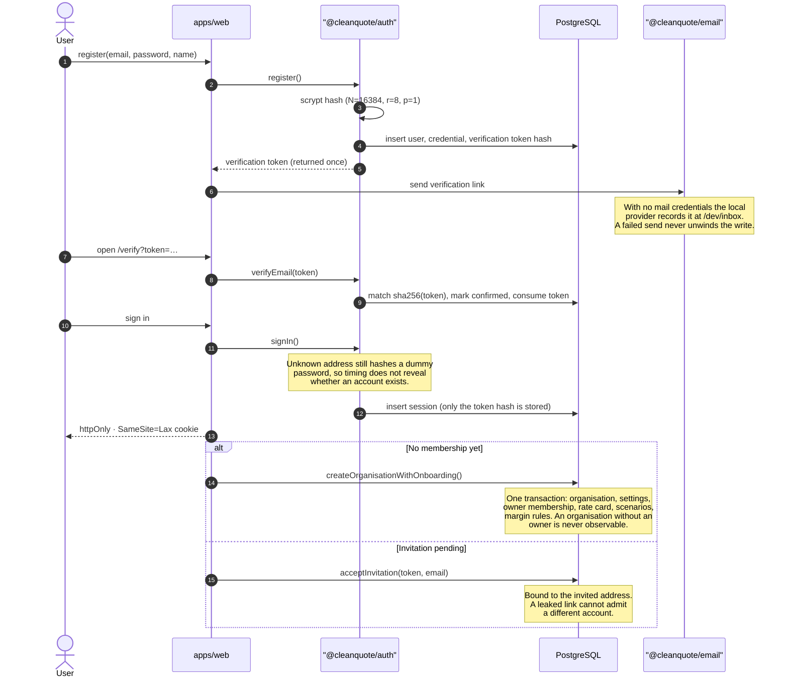
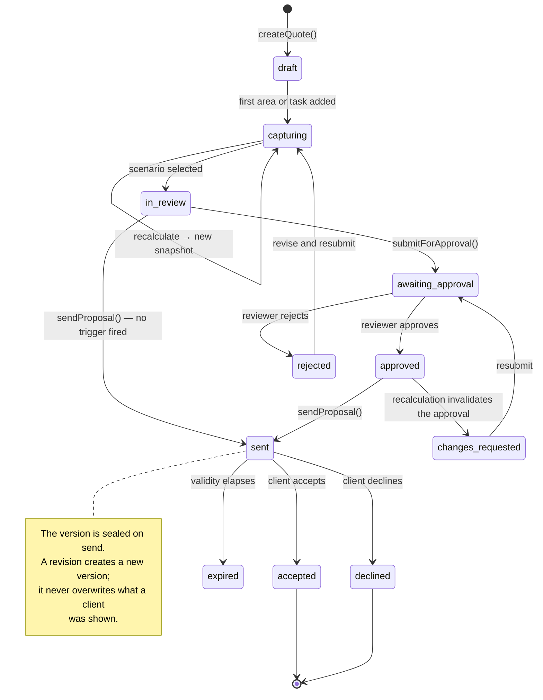
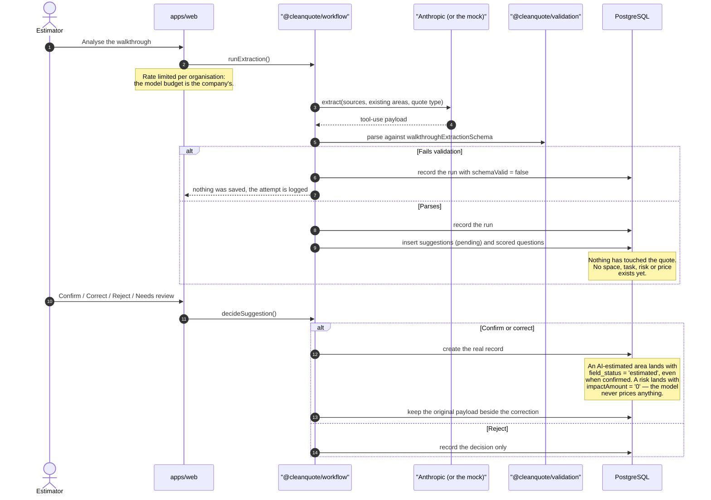
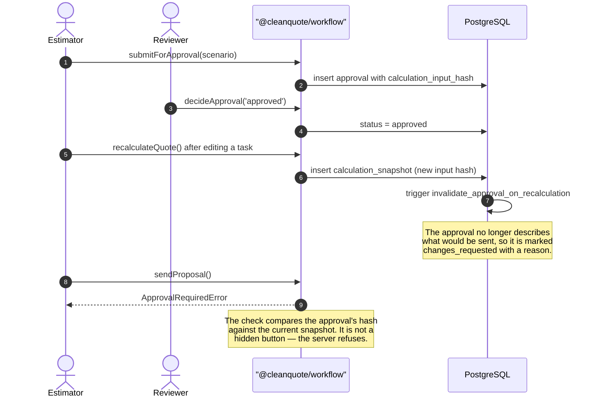
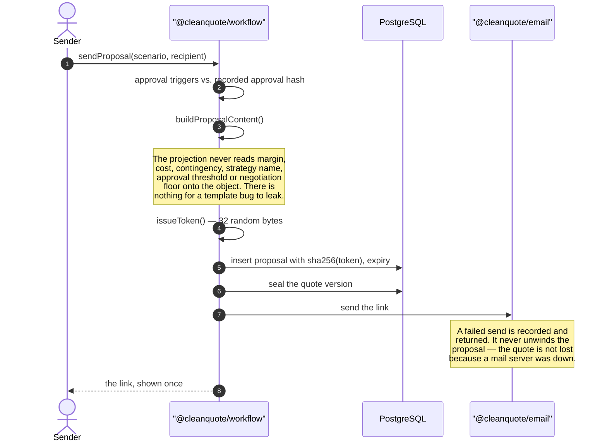
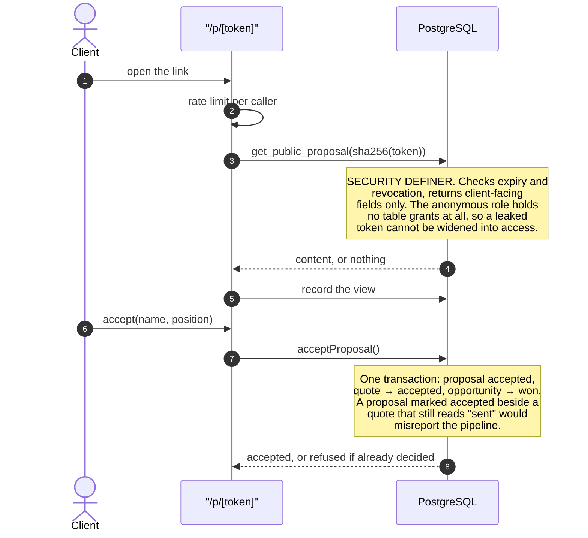

# The commercial workflow

How a quotation gets from an empty account to a signed acceptance, and what the system
refuses to do at each step. Every diagram here describes code that exists; where something
is not built, it says so rather than being drawn.

## Registration and organisation creation

An account and an organisation are separate things. A person registers, confirms an
address, and only then creates or joins a company — which is why an invited colleague
lands inside an existing organisation rather than accidentally founding a second one.

**Why the organisation is created with the application role rather than under RLS.** At the
moment of creation the caller is a member of nothing and could not satisfy an INSERT
policy. Splitting it into policy-governed statements would leave a window in which an
organisation exists with no owner. `createOrganisation` is the one write that runs
privileged, and it is a single transaction.

## The quote lifecycle

A quote binds to a rate-card version when it is created. Editing the rate card afterwards
changes what _future_ quotes are priced against and cannot reprice work in progress or
anything already sent.

## AI extraction and confirmation

The boundary the whole product rests on. A suggestion is a proposal until a person accepts
it; accepting is one deliberate action per item, and there is no bulk apply.

`visibleQuantity`, never `quantity`. Photo coverage of a site is partial by nature: "eight
visible windows" is a claim the evidence supports; "the site has eight windows" is not, and
the schema is where that distinction is enforced.

## Approval, and how it is invalidated

An approval is granted against one calculation. What makes "approved" mean anything is that
it stops meaning it when the numbers move.

The trigger is in the database rather than the application because the application is not
the only thing that can write a snapshot, and an approval that survives a change made
through any other path is worse than no approval at all.

## Proposal publication

Only the hash is stored, so the link cannot be recovered from the application afterwards —
reissuing is the recovery path, which is the same property that makes a database leak
useless for reading client proposals.

## Client acceptance

A revoked, expired, wrong or guessed token all produce the same answer: nothing here.
Distinguishing them would turn the link into an oracle.

## What this workflow does not do

- **It does not queue captured work offline.** The app is installable and caches its shell
  so a lost signal shows a readable page. Uploads are not resumed after the page closes,
  and the interface never says otherwise. See [STORAGE.md](STORAGE.md).
- **It does not measure.** AR measurement is not built. An area entered from a walkthrough
  is marked estimated and keeps saying so.
- **It does not convert a visual estimate into a site total.** An asset count is a visible
  count. Confirming one does not promote it.
